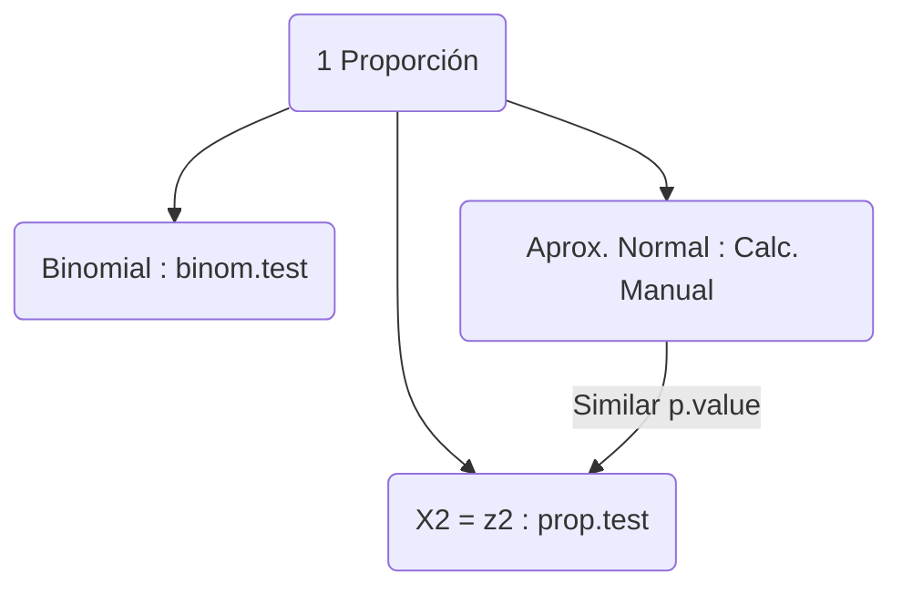
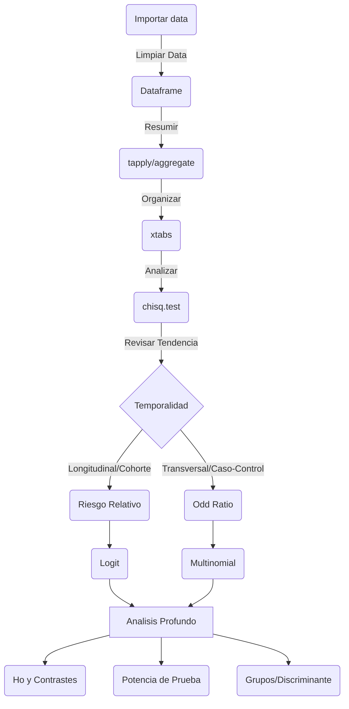

# 140426

Labores de hoy: 

- Libro non parametric Kloke.
  - Tablas cruzadas 2x2 analisis completo.
- Package R con data.
- Funciones dplyr y ggplot.
- Data Cleaning.

Pendientes:

- Funciones para gráficar:
  - Boxplot con grupos| incluir facet_wrap
  - Histogramas
  - Pruebas chi-squared

## Proporciones

Para 1 proporción usar 1 de 3 métodos:

- Cálculo manual (Aprox. Normal)

$$z=\frac{\hat{p}-p_{o}}{\sqrt{p_{o}(1-p_{o})/n}}$$

- Usando un $\chi^2=z^2$. Debe coincidir el $pvalue$ con el anterior.

  `prop.test(S,n,correct=TRUE)`

- Usando la dist. Binomial directamente.

  `binom.test(S,n,po)`



$S$= Número de éxitos en muestra $n$.

El valor estimado de p es $\hat{p}=\frac{S}{n}$.

Intervalo: $\hat{p} \pm z_{\alpha/2}\sqrt{\hat{p}(1-\hat{p})/n}$

- Ejemplo 2.2.1

```r
# Forma directa
p <- 10 / 143
za2 <- qnorm(.975)
p + c(-1, 1) * za2 * sqrt(p * (1 - p) / 143)

# Aproximación a la normal
prop.test(10,143,correct = FALSE)

# Los intervalos no coincidarán debido a que R los calcula con la inversa de la score test.
```
Son equivalentes: $\chi^2=z^2$ y R calcula los intervalos usando esa equivalencia.

- Ejemplo 2.2.2

```r
# Ho: 15/59=.15

# Calculando directamente usando distribución asintotica de S=exitos.
z <- (15 / 59 - .15) / (sqrt((.15) * (.85) / 59))
1 - pchisq(z^2, 1)

# R
prop.test(15,59,.15,correct=FALSE)

# Sí coinciden los p-value.

# Usando la Distribución Binomial
binom.test(15,59,.15)

# Aquí el p-value es muy diferente aunque tambien rechaza ha Ho. 
# Según el libro: "Debido a que los intervalos de confianza para muestras finitas son muy conservadores".
```

## Tablas

Flujo de analisis de tablas:

