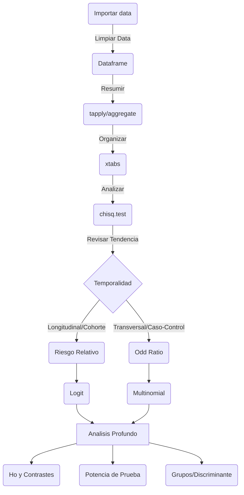

# 140426

Labores de hoy: 

- Libro non parametric Kloke.
  - Tablas cruzadas 2x2 analisis completo.
- Package R con data.
- Funciones dplyr y ggplot.
- Data Cleaning.

Pendientes:

- Funciones para gráficar:
  - Boxplot con grupos| incluir facet_wrap
  - Histogramas
  - Pruebas chi-squared

Flujo de analisis de tablas:

