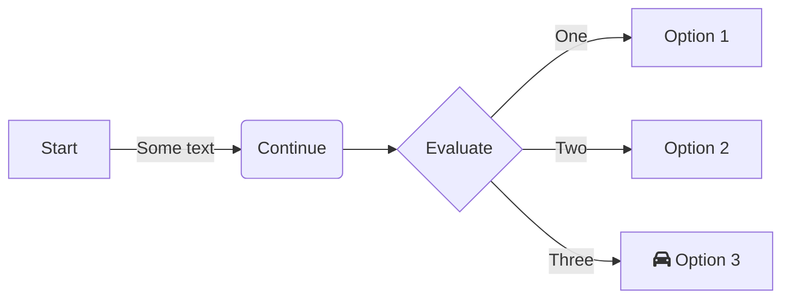
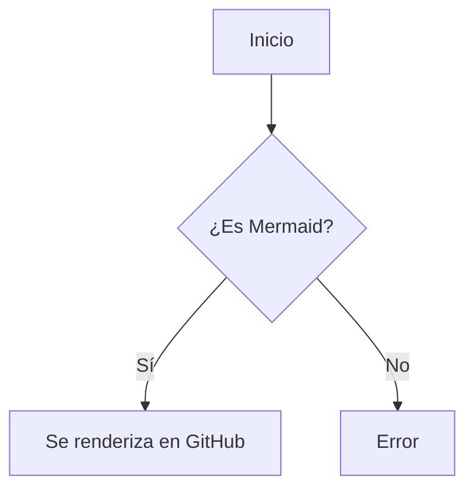

# 140426

Labores de hoy: 

- Libro non parametric Kloke.
  - Tablas cruzadas 2x2 analisis completo.
- Package R con data.
- Funciones dplyr y ggplot.
- Data Cleaning.

```mermaid
flowchart LR
  A[Start] --Some text--> B(Continue)
  B --> C{Evaluate}
  C -- One --> D[Option 1]
  C -- Two --> E[Option 2]
  C -- Three --> F[fa:fa-car Option 3]
```

```mermaid
graph TD
    A[Inicio] --> B{¿Es Mermaid?}
    B -- Sí --> C[Se renderiza en GitHub]
    B -- No --> D[Error]
```
